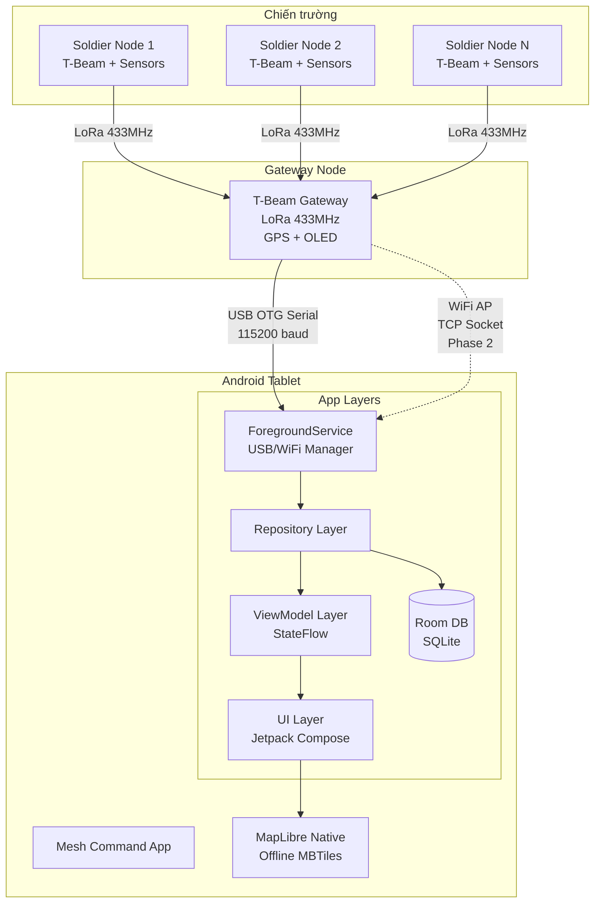
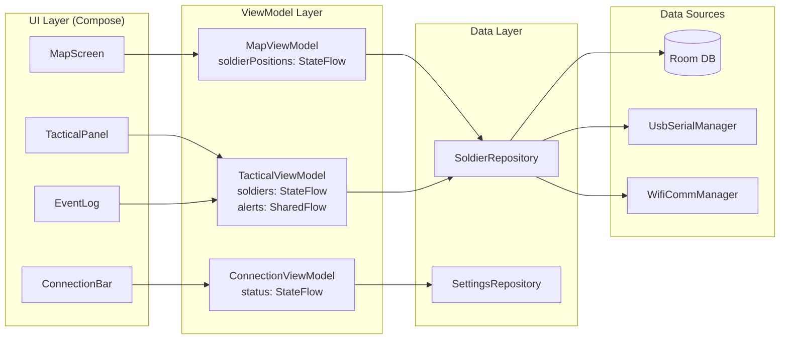
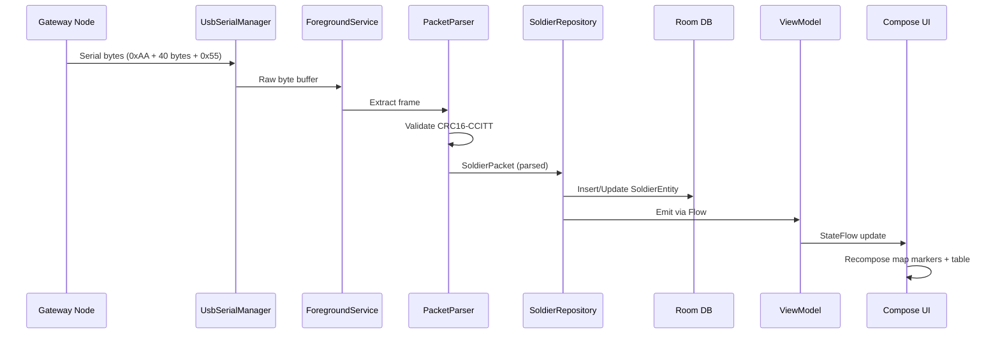
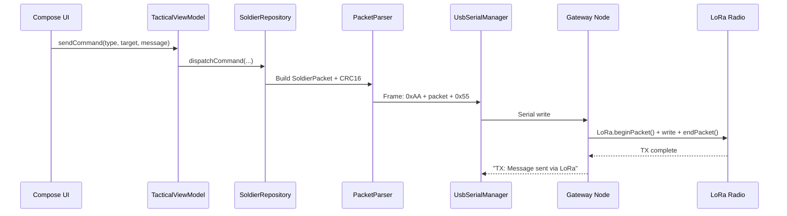

# ARCHITECTURE — Mesh Command Android App

## Tổng quan hệ thống

Ứng dụng Android native (Kotlin) trên máy tính bảng, hoạt động **100% offline**, kết nối với mạng lưới LoRa Mesh thông qua Gateway node. Ứng dụng thay thế phần mềm desktop Python (PySide6 + QWebEngineView) hiện tại bằng một giải pháp di động, triển khai được trên chiến trường.

### Sơ đồ tổng thể



## Kiến trúc ứng dụng

### MVVM + Repository Pattern



### Data Flow (Nhận dữ liệu từ Gateway)



### Data Flow (Gửi lệnh xuống Gateway)



## Giao thức truyền thông

### Binary Packet Protocol

```
┌──────┬─────────────────────────────────────┬──────┐
│ 0xAA │     SoldierPacket (40 bytes)        │ 0x55 │
│ START│                                     │ END  │
└──────┴─────────────────────────────────────┴──────┘

SoldierPacket Layout (packed, little-endian):
Offset  Size  Type     Field
──────  ────  ──────   ─────
0       2     uint16   nodeId
2       4     uint32   timestamp
6       4     float32  latitude
10      4     float32  longitude
14      4     float32  heading
18      1     uint8    heartRate
19      1     uint8    spo2
20      4     float32  temperature
24      4     float32  humidity
28      4     float32  pressure
32      4     float32  batteryVoltage
36      2     uint16   statusFlags
38      2     uint16   crc16
──────────────────────────────
Total: 40 bytes
```

### Status Flags Bitmap

| Bit | Hex | Flag | Ý nghĩa |
|-----|-----|------|----------|
| 0 | 0x0001 | GPS_FIX | GPS có fix |
| 1 | 0x0002 | IMU_VALID | IMU hoạt động |
| 2 | 0x0004 | HR_VALID | Nhịp tim hợp lệ |
| 3 | 0x0008 | SPO2_VALID | SpO2 hợp lệ |
| 4 | 0x0010 | TEMP_VALID | Nhiệt độ hợp lệ |
| 5 | 0x0020 | LOW_BATTERY | Pin yếu |
| 6 | 0x0040 | CRITICAL_BATTERY | Pin cực yếu |
| 7 | 0x0080 | SENSOR_ERROR | Lỗi cảm biến |
| 8 | 0x0100 | ALERT | Cảnh báo chung |
| 9 | 0x0200 | MAN_DOWN | Lính ngã |
| 10 | 0x0400 | HEAT_STRESS | Stress nhiệt |
| 11 | 0x0800 | HUMIDITY_VALID | Độ ẩm hợp lệ |
| 12 | 0x1000 | PRESSURE_VALID | Áp suất hợp lệ |

### CRC16-CCITT Algorithm

```
Polynomial: 0x1021
Initial value: 0xFFFF
Input: First 38 bytes of SoldierPacket (excluding crc16 field)
Output: 16-bit CRC stored in last 2 bytes
```

### Gateway GPS Sideband

Gateway cũng gửi vị trí GPS của chính nó qua serial dưới dạng text:
```
GW_GPS:<latitude>,<longitude>\n
```
Ví dụ: `GW_GPS:10.823099,106.629662\n`

## Kết nối phần cứng

### USB OTG Serial (Phase 1 — Kênh chính)

| Thông số | Giá trị |
|----------|---------|
| **Baudrate** | 115200 |
| **Data bits** | 8 |
| **Parity** | None |
| **Stop bits** | 1 |
| **Flow control** | None |
| **USB chip** | CP2102 / CH340 (ESP32 T-Beam) |
| **Library** | `usb-serial-for-android` (mik3y) |

**Auto-detection:** Filter USB devices by VID/PID:
- Silicon Labs CP210x: VID=0x10C4, PID=0xEA60
- WCH CH340: VID=0x1A86, PID=0x7523

### WiFi AP Mode (Phase 2 — Kênh phụ)

| Thông số | Giá trị |
|----------|---------|
| **Protocol** | TCP Socket |
| **Port** | 8888 |
| **SSID** | MESH_GW_001 |
| **Security** | WPA2 |
| **Payload** | Same binary packet protocol |

## Offline Map

### MapLibre Native + MBTiles

| Thông số | Giá trị |
|----------|---------|
| **Library** | `org.maplibre.gl:android-sdk` 11.x |
| **Tile format** | MBTiles (vector tiles) |
| **Tile source** | OpenMapTiles (OpenStreetMap data) |
| **Storage** | App internal storage (`context.filesDir`) |
| **Style** | Custom JSON style (military color scheme) |

**Offline workflow:**
1. Download `.mbtiles` file trên PC (tools: `tilemaker`, `OpenMapTiles`)
2. Copy vào tablet qua ADB hoặc file manager
3. App load từ `context.filesDir/maps/` directory
4. Style JSON referencing `mbtiles:///<absolute-path>`

## Technology Decisions

| Decision | Choice | Rationale |
|----------|--------|-----------|
| Platform | Native Android (Kotlin) | USB OTG, hardware access, performance |
| UI Framework | Jetpack Compose | Modern declarative UI, less boilerplate |
| Architecture | MVVM + Repository | Google-recommended, testable, lifecycle-aware |
| Map | MapLibre Native | Vector tiles, offline, actively maintained |
| Local DB | Room | Type-safe SQLite, Flow integration |
| DI | Hilt | Standard Android DI, lifecycle-aware |
| Async | Coroutines + Flow | Kotlin-native, structured concurrency |
| USB Serial | usb-serial-for-android | Battle-tested, supports CP210x/CH340 |
| Background | ForegroundService | Persistent connection, survives navigation |
| Build | Gradle KTS + Version Catalog | Type-safe, centralized dependency management |

## Diagram Applicability Matrix

| Diagram Type | Status | Notes |
|-------------|--------|-------|
| System Overview | **required** | ✅ Above |
| Data Flow (RX) | **required** | ✅ Above |
| Data Flow (TX) | **required** | ✅ Above |
| Module Dependencies | **required** | ✅ MVVM diagram above |
| Event Flows | **optional** | Covered by data flow sequences |
| Deployment | **N/A** | Single Android app, no server deployment |
| User Use Case | **optional** | Simple single-user (commander) app |
| ERD | **required** | See schemas/database-schema.sql |
