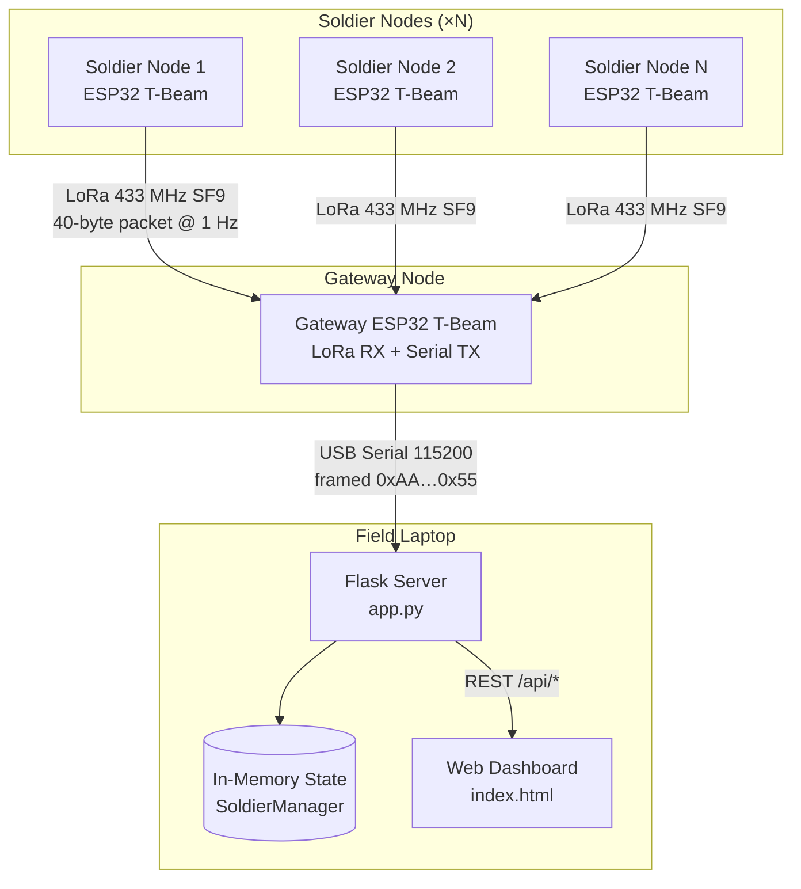
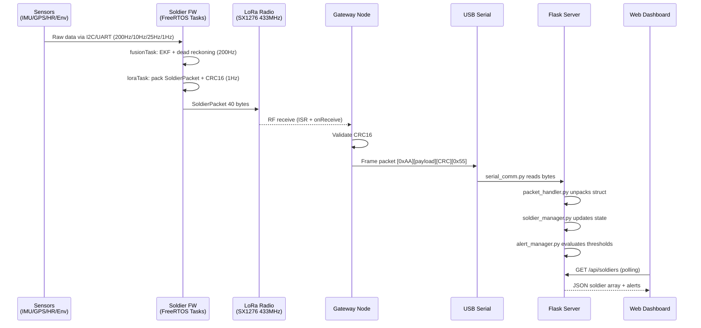

# ARCHITECTURE.md — Mesh Soldier Tracker

## System Overview

Mesh Soldier Tracker is a three-component IoT system for real-time field monitoring of military personnel:

1. **Soldier Node** (`soldier_node_production`) — wearable ESP32 device on each soldier. Reads biometric and environmental sensors at high frequency; runs dead-reckoning / EKF navigation; transmits 40-byte LoRa packets at 1 Hz.
2. **Gateway Node** (`gateway_node`) — fixed or vehicle-mounted ESP32. Receives LoRa packets from all soldier nodes, decodes them, and forwards over USB Serial to the PC server using a framed binary protocol (0xAA … 0x55 delimiters).
3. **Server / Dashboard** (`server`) — Python Flask application running on a field laptop connected via USB to the gateway. Parses serial frames, maintains in-memory soldier state, exposes a REST API, evaluates configurable health alerts, and serves a web dashboard.

## ViePilot Organization Context

Profile: none / not configured.

## Diagram Applicability Matrix

| Diagram Type | Status | Notes |
|---|---|---|
| `system-overview` | required | Core 3-component topology |
| `data-flow` | required | Sensor → LoRa → Serial → REST chain |
| `event-flows` | optional | Alert evaluation on packet arrival |
| `module-dependencies` | N/A | Single-file firmware modules; deps in platformio.ini |
| `deployment` | N/A | No container/cloud — local USB-serial deployment |
| `user-use-case` | optional | Lightweight description sufficient |

---

## System Overview Diagram

Diagram source: `.viepilot/architecture/system-overview.mermaid`



---

## Data Flow Diagram

Diagram source: `.viepilot/architecture/data-flow.mermaid`



---

## Event Flows (Alert Evaluation)

Status: optional — described inline.

On each received LoRa packet the server evaluates `alerts.conf` thresholds in `alert_manager.py`:

- Heart rate outside configured range → `WARNING` or `CRITICAL`
- SpO2 below threshold → `CRITICAL` or `EMERGENCY`
- Temperature / humidity / pressure out of range → `WARNING`
- Battery low/critical → `WARNING` / `CRITICAL`
- `MAN_DOWN` status flag set in packet → `EMERGENCY`
- `HEAT_STRESS` status flag → `CRITICAL`
- No packet for > 30 s → `OFFLINE` alert

Alert levels: `OK(0) → WARNING(1) → CRITICAL(2) → EMERGENCY(3)`

---

## Packet Protocol

### LoRa Packet (40 bytes, packed struct)

```
Bytes 0-1:   node_id       uint16
Bytes 2-5:   timestamp     uint32  (ms since boot)
Bytes 6-9:   latitude      float
Bytes 10-13: longitude     float
Bytes 14-17: heading       float   (degrees)
Byte  18:    heart_rate    uint8   (BPM)
Byte  19:    spo2          uint8   (%)
Bytes 20-23: temperature   float   (°C)
Bytes 24-27: humidity      float   (%)
Bytes 28-31: pressure      float   (hPa)
Bytes 32-35: battery_volt  float   (V)
Bytes 36-37: status_flags  uint16  (bitmask)
Bytes 38-39: crc16         uint16  (CRC-CCITT of bytes 0-37)
```

### Serial Frame (gateway → server)

```
[0xAA][40 bytes SoldierPacket][CRC16 low][CRC16 high][0x55]
```

### Status Flags Bitmask

```
0x0001 GPS_FIX
0x0002 IMU_VALID
0x0004 HR_VALID
0x0008 SPO2_VALID
0x0010 TEMP_VALID
0x0020 LOW_BATTERY
0x0040 CRITICAL_BATTERY
0x0080 SENSOR_ERROR
0x0100 ALERT
0x0200 MAN_DOWN
0x0400 HEAT_STRESS
0x0800 HUMIDITY_VALID
0x1000 PRESSURE_VALID
```

---

## Technology Decisions

| Decision | Choice | Rationale |
|---|---|---|
| RF protocol | LoRa SF9 @ 433 MHz | Range up to 2 km LOS; better obstacle penetration than SF7 |
| Packet size | 40 bytes fixed | Fits LoRa payload; fixed size simplifies parsing |
| Error detection | CRC-CCITT 16 | Standard, lightweight, reliable for 38-byte payload |
| Navigation | EKF + Madgwick AHRS | Fuses GPS + IMU; continues dead-reckoning indoors |
| Serial framing | 0xAA…0x55 delimiters | Simple, byte-efficient framing for binary packets |
| Server runtime | Flask + gevent | Sufficient for single-gateway local use; no cloud needed |
| Alert config | INI file (`alerts.conf`) | Operator-configurable thresholds without code changes |

---

## FreeRTOS Task Architecture (Soldier Node)

| Task | Core | Priority | Stack | Period | Responsibility |
|---|---|---|---|---|---|
| `sensorTask` | 0 | 2 | 4096 | 5 ms | IMU @ 200Hz, HR @ 25Hz, Env @ 1Hz |
| `gpsTask` | 0 | 1 | 2048* | 100 ms | GPS NMEA parsing |
| `fusionTask` | 1 | 2 | 4096 | 5 ms | Madgwick AHRS, EKF, dead reckoning |
| `loraTask` | 1 | 1 | 2048 | 1000 ms | Pack & transmit, battery monitoring |
| `displayTask` | 1 | 1 | 2048 | 500 ms | OLED update |

*\* `gpsTask` stack flagged for potential overflow — recommend 3072 words (see SYSTEM-RULES).*
