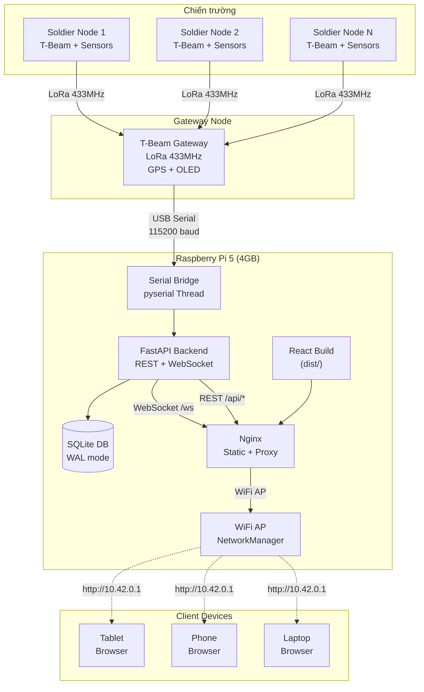
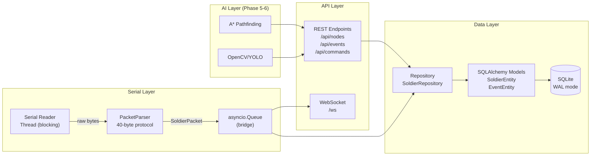
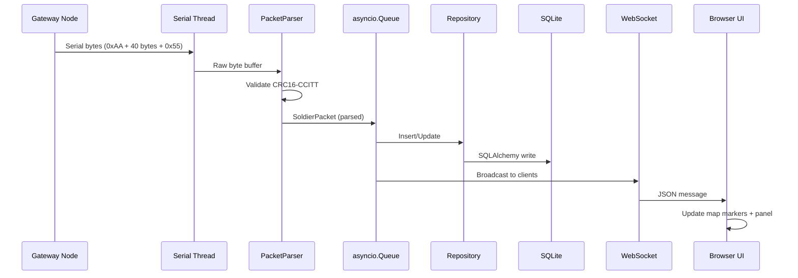
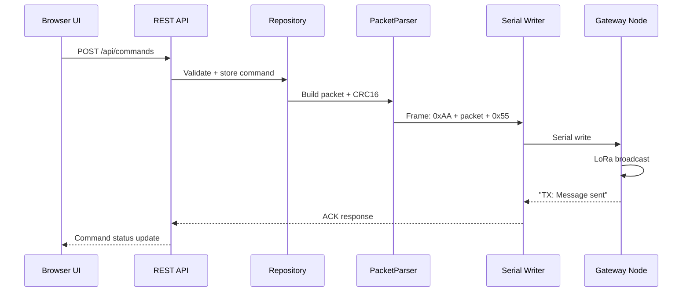
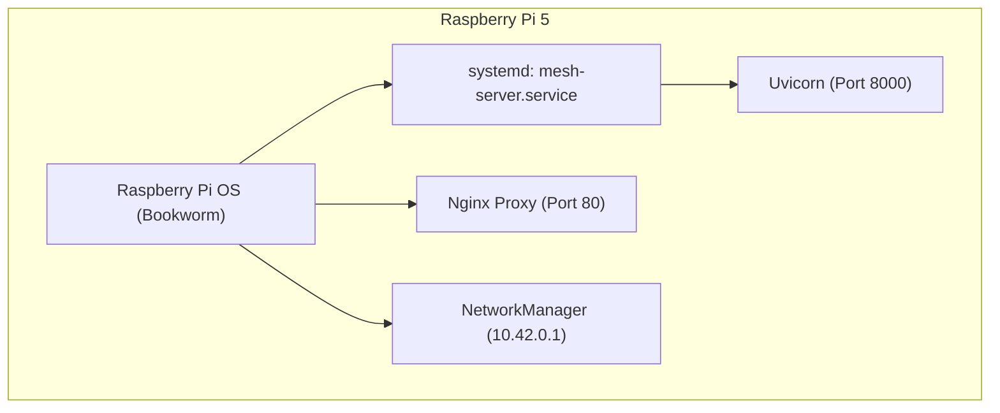
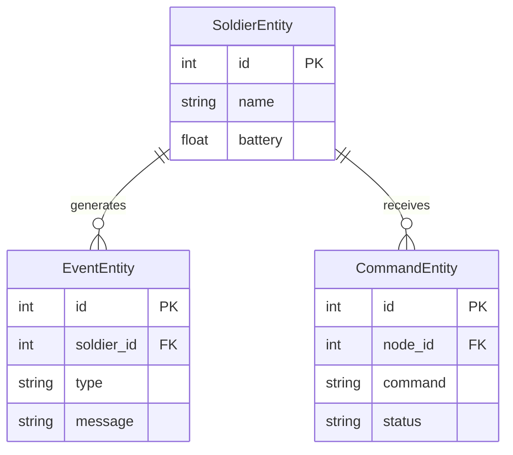

# ARCHITECTURE — Mesh Pi5 Server

## Tổng quan hệ thống

Hệ thống Web-based Command & Control chạy trên Raspberry Pi 5, kết nối trực tiếp với LoRa Gateway qua USB Serial, phát WiFi AP để các thiết bị đầu cuối (tablet, phone, laptop) truy cập dashboard chiến thuật qua trình duyệt web. Hoạt động **100% offline** tại thực địa.

### Sơ đồ tổng thể



## Kiến trúc Backend

### FastAPI Application Structure



### Data Flow (Nhận dữ liệu từ Gateway)



### Data Flow (Gửi lệnh xuống Gateway)



## Giao thức truyền thông

### Binary Packet Protocol (kế thừa từ firmware hiện tại)

```
┌──────┬─────────────────────────────────────┬──────┐
│ 0xAA │     SoldierPacket (40 bytes)        │ 0x55 │
│ START│                                     │ END  │
└──────┴─────────────────────────────────────┴──────┘

SoldierPacket Layout (packed, little-endian):
Offset  Size  Type     Field
──────  ────  ──────   ─────
0       2     uint16   nodeId
2       4     uint32   timestamp
6       4     float32  latitude
10      4     float32  longitude
14      4     float32  heading
18      1     uint8    heartRate
19      1     uint8    spo2
20      4     float32  temperature
24      4     float32  humidity
28      4     float32  pressure
32      4     float32  batteryVoltage
36      2     uint16   statusFlags
38      2     uint16   crc16
──────────────────────────────
Total: 40 bytes
```

### CRC16-CCITT
```
Polynomial: 0x1021
Initial value: 0xFFFF
Input: First 38 bytes (excluding crc16 field)
```

## Kết nối phần cứng

### USB Serial (Pi 5 ↔ Gateway)

| Thông số | Giá trị |
|----------|---------|
| **Port** | `/dev/ttyUSB0` (CP2102) hoặc `/dev/ttyACM0` |
| **Baudrate** | 115200 |
| **Data bits** | 8 |
| **Parity** | None |
| **Stop bits** | 1 |
| **USB chip** | CP2102 / CH340 (ESP32 T-Beam) |

### WiFi Access Point

| Thông số | Giá trị |
|----------|---------|
| **Method** | NetworkManager (nmcli) |
| **Interface** | wlan0 (built-in) |
| **SSID** | MESH_COMMAND_WIFI |
| **Security** | WPA2 |
| **IP** | 10.42.0.1 |
| **DHCP** | Auto (NetworkManager) |

### Nginx Reverse Proxy

| Route | Target |
|-------|--------|
| `/` | `frontend/dist/` (static) |
| `/api/*` | `http://127.0.0.1:8000` (FastAPI) |
| `/ws` | `ws://127.0.0.1:8000/ws` (WebSocket) |
| `/maps/*.pmtiles` | `maps/` directory (static) |

## Technology Decisions

| Decision | Choice | Rationale |
|----------|--------|-----------|
| Platform | Raspberry Pi 5 (4GB) | Đủ mạnh cho server + AI, tiết kiệm năng lượng, nhỏ gọn triển khai thực địa |
| Backend | Python FastAPI | Async native, WebSocket tích hợp, hệ sinh thái AI/ML (OpenCV, PyTorch) |
| Frontend | React + Vite + TypeScript | Build nhanh, component architecture, type-safe |
| Map Engine | MapLibre GL JS | Vector tiles offline, hỗ trợ 3D Terrain & Fill-extrusion (buildings), không cần tile server |
| Map Data | PMTiles (Vector + Raster DEM) | Đóng gói toàn bộ tiles vào 1 file duy nhất, truy xuất HTTP Range Request cực nhanh offline |
| Map Style | Custom Multi-color Vector | Mượn tư tưởng của `VectorTileRenderer` để tạo màu sắc thực địa rõ nét (OSM Liberty concept) |
| Database | SQLite (WAL) | Nhẹ, không cần DB server, phù hợp nhúng |
| Serial | pyserial + Thread | Đọc blocking I/O trong thread riêng, bridge qua asyncio.Queue |
| Proxy | Nginx | Serve static + proxy API/WS, production-grade, ~5MB RAM |
| WiFi AP | NetworkManager | Chuẩn Pi OS Bookworm, tự động DHCP/NAT |
| AI Pathfinding | A* (Phase 5) | Tìm đường offline trên road network OSM |
| AI Vision | OpenCV/YOLO (Phase 6) | Nhận diện mục tiêu từ camera Pi |

## Advanced Map Rendering Engine (Phase 9)

Hệ thống sử dụng **MapLibre GL JS** kết hợp với kiến trúc file **PMTiles** để đem đến trải nghiệm bản đồ tác chiến 3D hoàn toàn offline:

1. **Multi-color Vector Styling:** Giao diện đường xá/công viên/sông ngòi được styling với nhiều màu sắc chuyên biệt (kế thừa triết lý từ `AliFlux/VectorTileRenderer`) để chỉ huy dễ dàng nhận diện cấu trúc địa lý thực địa.
2. **3D Terrain (Đồi núi 3D):** Sử dụng file `terrain.pmtiles` chứa dữ liệu RGB DEM (Digital Elevation Model). Khi load vào MapLibre với cấu hình `terrain`, bề mặt bản đồ sẽ nổi lên thành đồi núi thực tế thay vì mặt phẳng 2D.
3. **3D Buildings:** Kết hợp layer `fill-extrusion` đọc từ dữ liệu vector (OSM) để đẩy các tòa nhà thành khối 3D trên bản đồ, hỗ trợ quan sát góc nhìn chiến thuật trong khu dân cư.

## Diagram Applicability Matrix

| Diagram Type | Status | Notes |
|-------------|--------|-------|
| System Overview | **required** | ✅ Above |
| Data Flow (RX) | **required** | ✅ Above (sequence) |
| Data Flow (TX) | **required** | ✅ Above (sequence) |
| Module Dependencies | **required** | ✅ Backend structure above |
| Deployment | **required** | Added Mermaid block |
| Event Flows | **optional** | Covered by data flow sequences |
| User Use Case | **optional** | Single-user (commander) + multi-viewer |
| ERD | **required** | Added Mermaid block (schemas/database-schema.sql) |

## Deployment Sơ đồ



## Entity Relationship Diagram (ERD)


